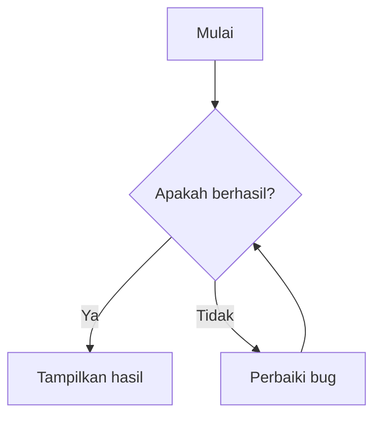
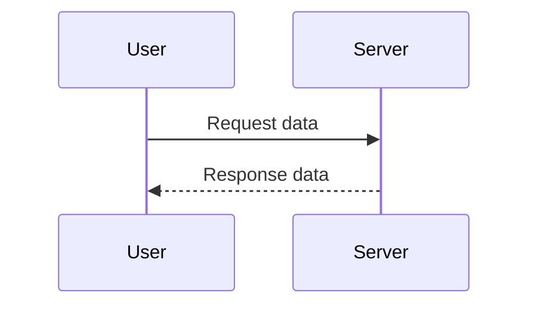
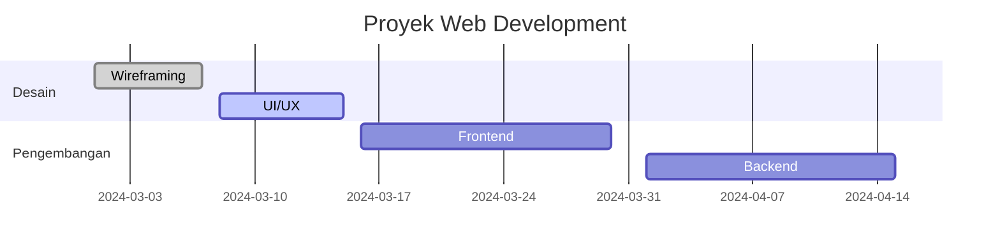

This content shows a preview of typography elements supported by the **My Notes** theme.  
**Happy Reading!**

## Headings
Here are examples of various **headings**:

# Heading 1  
## Heading 2  
### Heading 3  
#### Heading 4  
##### Heading 5  
###### Heading 6  

## Lists
### Unordered List
- List 1  
- List 2  
  - List 1 inside List 2  
  - List 2 inside List 2  
- List 3  

### Ordered List  
1. Ordered List 1  
2. Ordered List 2  
   1. Ordered List 1 inside Ordered List 2  
   2. Ordered List 2 inside Ordered List 2  
3. Ordered List 3  

### Definition List
First Term  
: This is the definition of the first term.  

Second Term  
: This is the definition of the second term.  
: This is another definition of the second term.  

## Task List
- [ ] Not done  
- [x] Done  

## Columns 
### Konten kolom pertama.
Est excepteur labore proident eu aliquip cillum reprehenderit irure consectetur consectetur anim. Sunt consequat anim commodo minim elit cupidatat elit commodo dolor aute adipisicing id. Occaecat cillum culpa laborum magna. Enim ut do magna nulla nulla minim nulla. Eu aute laboris elit excepteur eu eiusmod occaecat commodo. Enim anim commodo et eu laborum labore culpa deserunt sunt sit.

### Konten kolom kedua.
Dolore Lorem qui ex ea in velit enim exercitation. Occaecat velit laboris velit laboris aliquip ullamco elit magna cupidatat aliquip. Sint ullamco enim labore Lorem ullamco sit fugiat mollit nulla voluptate nulla mollit.

## Table

| Name  | Age | Hobby      | Profession |  
| ----- | ---- | --------- | ------- |  
| Ana   | 27   | Cooking   | Doctor  |  
| Budi  | 30   | Fishing   | Teacher    |  
| Arif  | 35   | Cycling   | Pilot   |  
| Agung | 21   | Reading   | Student |  

## Images  
### Left Aligned Image  
Anim nostrud cupidatat aliquip nulla fugiat fugiat ullamco exercitation dolore proident culpa laborum adipisicing anim. Officia nisi laborum laborum non reprehenderit consectetur qui culpa consequat. In amet nulla dolore nostrud proident duis laboris et officia sit. Tempor dolore voluptate in mollit deserunt non incididunt ex nostrud non officia nisi ut dolore.


Reprehenderit enim nisi magna cillum aute eiusmod aute laboris ut. Aliqua voluptate exercitation ea sint deserunt magna et. Aliqua quis esse id consequat consequat irure quis eu occaecat exercitation officia nisi do est. Sint minim duis minim adipisicing consequat duis.

### Right Aligned Image  
Consequat anim aliquip veniam consequat officia aliqua. Ullamco tempor deserunt cillum irure. Et est ut laborum ad laboris consectetur laborum consectetur esse minim ad. Est ut cillum fugiat occaecat adipisicing ipsum irure Lorem elit reprehenderit sit anim anim incididunt. Magna sunt velit in laboris ad proident aliqua magna fugiat irure aliqua consectetur. Esse anim sit ad pariatur commodo occaecat est quis.


Duis eiusmod amet est aliquip cillum labore consectetur deserunt. Labore aliqua cillum mollit cupidatat ullamco. Mollit dolore aliqua nostrud occaecat labore cillum et labore. Sint velit culpa et fugiat incididunt excepteur reprehenderit Lorem duis voluptate voluptate occaecat. Est quis labore irure in adipisicing nisi. Sunt et dolor in Lorem irure laborum deserunt. Incididunt aute id ad Lorem nostrud culpa elit ipsum id.

### Center Aligned Image  
Laborum ex duis voluptate tempor consequat veniam velit sunt elit. Elit et ipsum ullamco amet aliquip ea ullamco incididunt consequat do aliquip cillum. Anim ullamco non excepteur ullamco consectetur.


Reprehenderit veniam enim adipisicing duis anim aliquip sint laboris esse sint. Officia adipisicing esse aliquip cupidatat. Commodo nostrud laboris dolore ut incididunt fugiat est nostrud duis et non ullamco velit. Veniam duis nisi irure occaecat veniam adipisicing dolor commodo. Cupidatat culpa id nisi do dolore pariatur.

## Links  

[Go to Google](https://www.google.com)  

## Quotes and Alerts  

### Default Quote  

> This is a default quote.  

### Quote with Alerts  
> [!INFO] Information  
> This is an information alert.  

> [!TIP] Tips  
> This is a tip alert.  

> [!WARNING] Warning  
> This is a warning alert.  

> [!DANGER] Danger  
> This is a danger alert.  

> [!ERROR] Error  
> This is an error alert.

See complete Visit: [Alert Collection](callout.md)  

## Code  

### Python
```python
#!/usr/bin/env python3
# -*- coding: utf-8 -*-
# This is a sample Python script to test syntax highlighting

import re
from typing import List, Dict

# Constants
HEX_VALUE = 0xFF
PI = 3.14159
CONFIG_PATH = "/etc/config.yaml"

class Shape:
    """A simple class with a method and a property."""
    def __init__(self, name: str, sides: int = 0):
        self.name = name
        self.sides = sides

    @property
    def description(self) -> str:
        return f"{self.name} with {self.sides} sides"

    def area(self) -> float:
        raise NotImplementedError("Subclasses should implement this!")

class Circle(Shape):
    def __init__(self, radius: float):
        super().__init__("Circle")
        self.radius = radius

    def area(self) -> float:
        return PI * self.radius ** 2

def parse_config(text: str) -> Dict[str, str]:
    """Parses a config file using regex."""
    return dict(re.findall(r"^(\w+):\s*(.+)$", text, re.MULTILINE))

def main():
    shapes: List[Shape] = [
        Circle(5.5),
        Shape("Triangle", 3)
    ]
    for shape in shapes:
        try:
            print(shape.description)
            print(f"Area: {shape.area():.2f}")
        except Exception as e:
            print(f"Error: {e}")

if __name__ == "__main__":
    main()

```

### Bash
```bash
#!/bin/bash
# A sample Bash script to test syntax highlighting

# Constants and variables
readonly FILE_PATH="/etc/passwd"
USER_NAME="$(whoami)"
NUMBER=42
PI=3.14

# Function with parameters
greet_user() {
  local name="$1"
  echo "Hello, $name"
}

# Control flow
if [[ -f "$FILE_PATH" ]]; then
  echo "File exists: $FILE_PATH"
else
  echo "File not found."
fi

# Loops
for i in {1..5}; do
  echo "Number $i"
done

# While loop with arithmetic
count=0
while (( count < NUMBER )); do
  ((count++))
done

# Case statement
case "$USER_NAME" in
  root) echo "You're root!" ;;
  *)    echo "You're a regular user." ;;
esac

# Heredoc and command substitution
cat <<EOF
User: $USER_NAME
PI: $PI
Date: $(date)
EOF

# Arrays and regex
fruits=("apple" "banana" "cherry")
for fruit in "${fruits[@]}"; do
  if [[ "$fruit" =~ ^a.* ]]; then
    echo "$fruit starts with 'a'"
  fi
done

# Export and function call
export PATH="$PATH:/custom/bin"
greet_user "$USER_NAME"

```

### Golang
```go
package main

import "fmt"

func main() {
    fmt.Println("Hello, World!")

    // Addition operation
    a := 5
    b := 3
    hasil := a + b
    fmt.Printf("Hasil penjumlahan %d + %d = %d\n", a, b, hasil)
}
```

## Matematika

$$
\int_{0}^{\infty} \frac{x^2 e^{-x^2}}{1 + e^{x}} \, dx = \frac{\sqrt{\pi}}{2} \left( \text{Li}_2 \left( -e^{-1} 
\right) - \text{Li}_2 \left( -e^{-2} \right) \right)  
$$  

## Diagram
### Flowchart



### Sequence Diagram



### Gantt Chart



### GoAT ASCII  
```goat
    +---------+
    |  Root   |
    +----+----+
         |
    +----+----+
    |         |
  +----+   +----+
  | A  |   | B  |
  +----+   +----+
```

```goat
    +---------+
    |  Root   |
    +----+----+
         |
    +----+----+
    |         |
  +----+   +----+
  | A  |   | B  |
  +----+   +----+
```

## YouTube

## HTML in Markdown

<p style="color: red; font-weight: 700;">Red Text With 700 Weight</p>